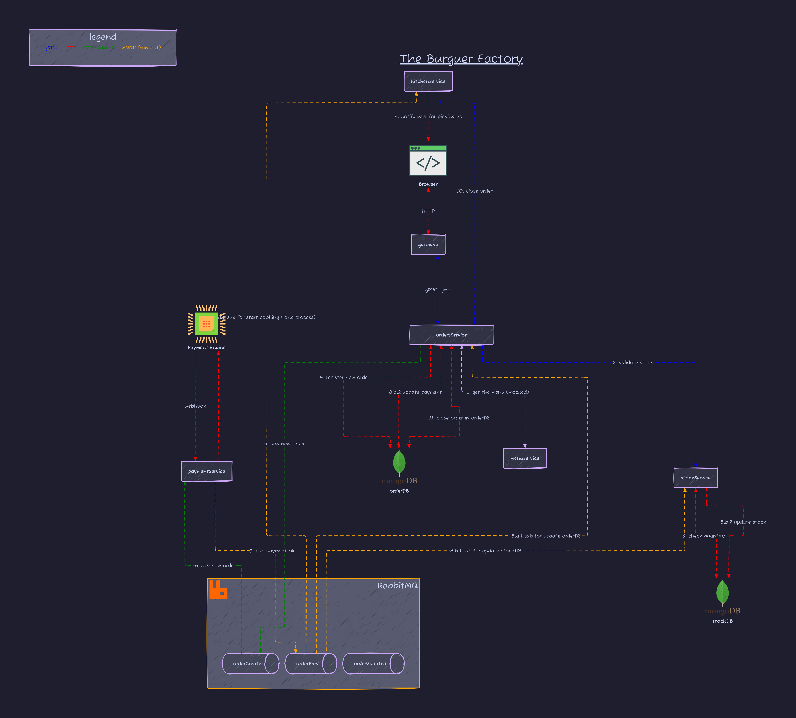

# The Burguer Factory

Note: This project uses multi-module workspaces, so each folder represents a microservice repository

e.g. Github

i.e. I will not create those repositories

## Architecture

Go to [./docs/arch.png](./docs/arch.png)



## Installation

```bash
# arch
$ pacman -S nodejs npm

# node
$ npm install -D tailwindcss
$ npm install -D daisyui@latest

# go
$ go install github.com/a-h/templ/cmd/templ@latest
$ go install github.com/cosmtrek/air@latest

# diagrams
$ go install oss.terrastruct.com/d2@latest


$ export PATH="$PATH:$(go env GOPATH)/bin"

$ go work init commons/ gateway/ kitchen/ orders/ payments/ stock/
```

## References

### Workspaces

[Get familiar with workspaces](https://go.dev/blog/get-familiar-with-workspaces)

[Tutorial: Getting started with multi-module workspaces](https://go.dev/doc/tutorial/workspaces)

### Diagrams

[comments]: https://github.com/HariSekhon/Diagrams-as-Code

[d2 github](https://github.com/terrastruct/d2) and [d2 doc](https://d2lang.com/)

[Terrastruct icons](https://icons.terrastruct.com/)

[mingrammer](https://diagrams.mingrammer.com/)